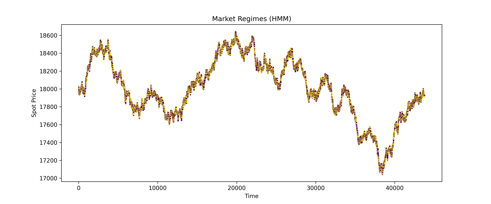

# Quantitative Trading Strategy – NIFTY 50

## Overview
This project implements an end-to-end quantitative trading system for the NIFTY 50 index using
5-minute frequency spot, futures, and options data. The pipeline covers data engineering, feature
engineering, market regime detection, strategy logic, machine learning–based filtering, and
post-trade statistical analysis.

The focus of this project is on pipeline correctness, robustness, and modular design, rather
than absolute trading performance.

## Project Structure
data/       → Raw and engineered CSV datasets  
notebooks/  → Step-by-step Jupyter notebooks (1–7)  
src/        → Reusable Python modules (strategy, ML, analysis)  
models/     → Saved ML predictions  
results/    → Strategy outputs and trade analytics  
plots/      → Generated charts and visualizations  

Key Components

1. Feature Engineering

EMA (5, 15)
Returns
Spot–Futures basis
Options Greeks (Black-Scholes framework)
Put–Call Ratio (PCR)

2. Regime Detection
Gaussian Hidden Markov Model (HMM)
Market regimes inferred from returns
Regimes used as a filter, not a predictor

3. Trading Strategy
EMA (5,15) crossover
Regime-aware entry logic
Conservative exit rules to reduce noise

4. Machine Learning Layer
XGBoost classifier
Predicts short-horizon price direction (5-candle lookahead)
Dynamic feature selection based on available engineered features
Designed for portability (no heavy deep-learning dependencies)

5. Outlier & Performance Analysis
Trade reconstruction from strategy signals
Z-score–based outlier detection
Robust handling of zero-trade regimes
Diagnostic visualizations (PnL vs duration, distributions, correlations)

## Sample Outputs
### Market Regime Detection (HMM)
Hidden Markov Model used to classify market regimes based on return dynamics.

### Trade Performance Analysis
Relationship between trade duration and profitability across regimes.

## How to Run

Install dependencies:
pip install -r requirements.txt

## run notebooks sequentially:

notebooks/1_*  →  notebooks/7_*

Each notebook builds on outputs from the previous step.

## Notes & Assumptions
Futures rollover handled using nearest-expiry logic
Risk-free rate assumed at 6.5%
ML accuracy is not optimized for alpha; emphasis is on clean architecture
LSTM is included as a conceptual extension; the final implementation uses tree-based ML for stability
Zero-trade outcomes are treated as valid market conditions and handled gracefully

## System Architecture

The project follows a modular, step-by-step quantitative research pipeline:

Raw Market Data (Spot / Futures / Options)
                │
                ▼
        Data Cleaning & Alignment
                │
                ▼
        Feature Engineering
 (EMA, Returns, Greeks, PCR, Basis)
                │
                ▼
        Regime Detection (HMM)
                │
                ▼
        Trading Strategy
     (EMA Crossover + Regime Filter)
                │
                ▼
        Machine Learning Filter
        (XGBoost Classifier)
                │
                ▼
        Backtesting & Trade Logs
                │
                ▼
     Outlier Analysis & Visualization

Each module is implemented independently to ensure clarity, testability, and robustness.
